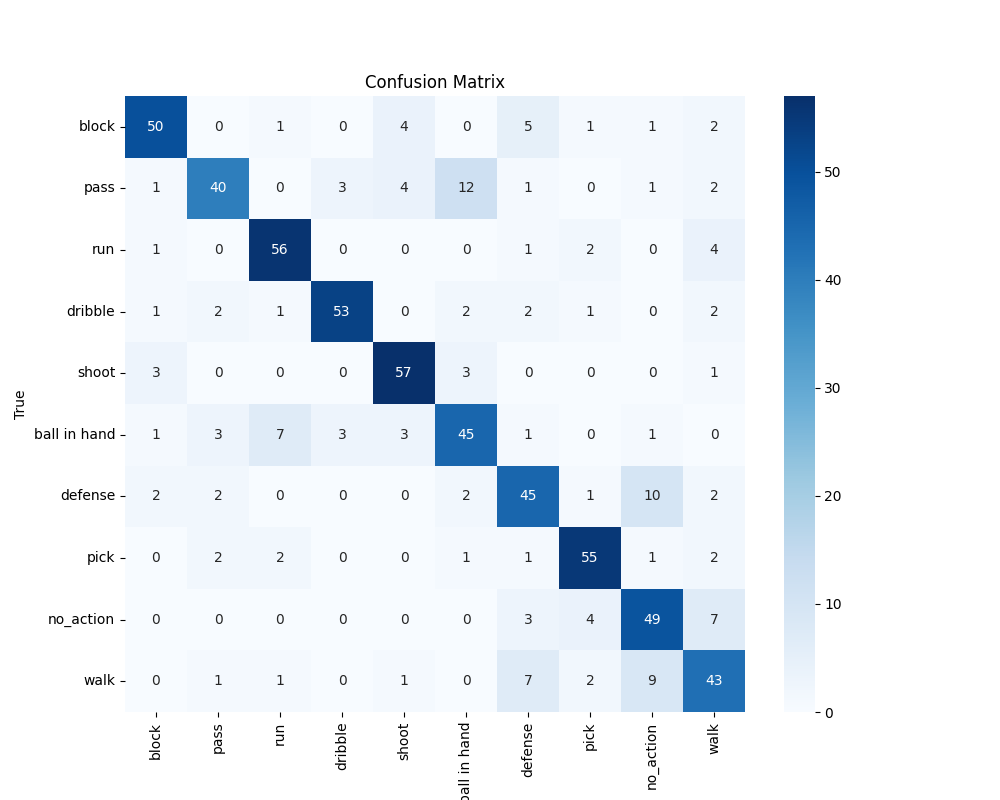

 
# Basketball Action Recognition Using PyTorch

This project focuses on classifying basketball actions from video clips using a deep learning model built with PyTorch. The model is based on the `slow_r50` architecture from the `pytorchvideo` library, fine-tuned for a custom dataset of basketball actions.

---

## Table of Contents
1. [Project Overview](#project-overview)
2. [Dataset](#dataset)
3. [Requirements](#requirements)
8. [Results](#results)

---

## Project Overview
The goal of this project is to classify basketball actions such as "block," "pass," "run," "dribble," "shoot," and others from video clips. The model is trained on a custom dataset and evaluated using metrics like accuracy, classification report, and confusion matrix.

---

## Dataset
You can download the entire Dataset (both joints and clips) from [here](https://drive.google.com/open?id=1hLpbLmLFK2-GIvsmpJelGlEx94yQM2Ts).

The dataset consists of video clips labeled with one of the following actions:
- `block`
- `pass`
- `run`
- `dribble`
- `shoot`
- `ball in hand`
- `defense`
- `pick`
- `no_action`
- `walk`

### Dataset Structure
- Videos are stored in the `examples` directory.
- Annotations are stored in a JSON file (`annotation_dict.json`) where each key is the video filename (without extension) and the value is the corresponding label.

### Class Distribution
The dataset is balanced by sampling an equal number of videos from each class to avoid bias.

---
## Requirements
```
natsort==8.2.0
tqdm==4.64.1
torch==1.12.1
numpy
yt-dlp==2022.9.1
pandas
pytorchvideo==0.1.5
torchvision==0.13.1
pytorch-lightning==1.7.6
opencv-python==4.6.0.66
Pillow==9.2.0
matplotlib==3.1.2
scipy==1.4.1
scikit-image
albumentations
sk-video==1.1.10
scikit-learn
boto3
seaborn
torch-summary==1.4.5
openpyxl
```
---
## Result
```
Test Accuracy: 0.7715179968701096                                                                                                                                             
Classification Report:                                                                                                                                                        
               precision    recall  f1-score   support

       block       0.85      0.78      0.81        64
        pass       0.80      0.62      0.70        64
         run       0.82      0.88      0.85        64
     dribble       0.90      0.83      0.86        64
       shoot       0.83      0.89      0.86        64
ball in hand       0.69      0.70      0.70        64
     defense       0.68      0.70      0.69        64
        pick       0.83      0.86      0.85        64
   no_action       0.68      0.78      0.73        63
        walk       0.66      0.67      0.67        64

    accuracy                           0.77       639
   macro avg       0.77      0.77      0.77       639
weighted avg       0.77      0.77      0.77       639
```

