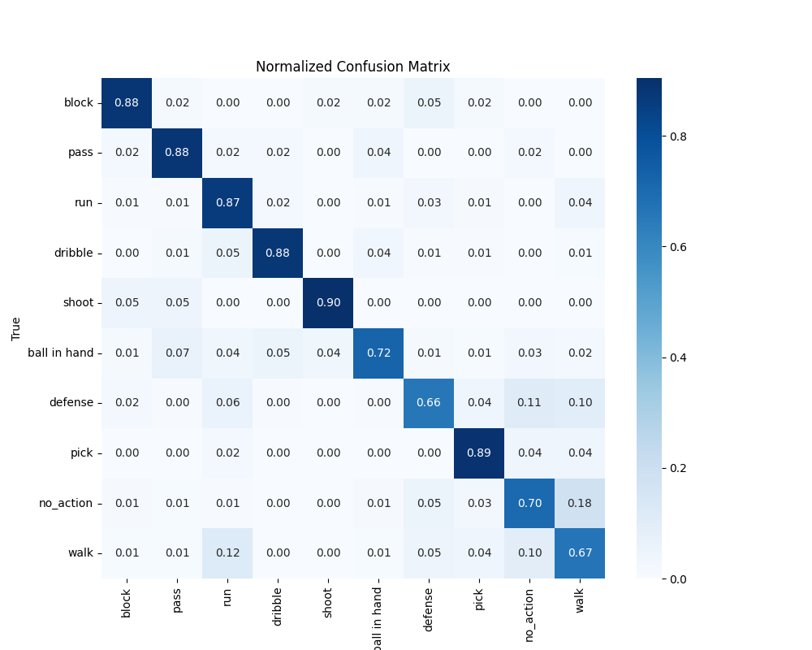

 
# Basketball Action Recognition Using PyTorch

This project focuses on classifying basketball actions from video clips using a deep learning model built with PyTorch. The model is based on the `slow_r50` architecture from the `pytorchvideo` library, fine-tuned for a custom dataset of basketball actions.

---

## Table of Contents
1. [Project Overview](#project-overview)
2. [Dataset](#dataset)
3. [Requirements](#requirements)
8. [Results](#results)

---

## Project Overview
The goal of this project is to classify basketball actions such as "block," "pass," "run," "dribble," "shoot," and others from video clips. The model is trained on a custom dataset and evaluated using metrics like accuracy, classification report, and confusion matrix.

---

## Dataset
You can download the entire Dataset (both joints and clips) from [here](https://drive.google.com/open?id=1hLpbLmLFK2-GIvsmpJelGlEx94yQM2Ts).

The dataset consists of video clips labeled with one of the following actions:
- `block`
- `pass`
- `run`
- `dribble`
- `shoot`
- `ball in hand`
- `defense`
- `pick`
- `no_action`
- `walk`

### Dataset Structure
- Videos are stored in the `examples` directory.
- Annotations are stored in a JSON file (`annotation_dict.json`) where each key is the video filename (without extension) and the value is the corresponding label.

### Class Distribution
```
Original Class Distribution:
0      996
1     1070
2     5924
3     3490
4      426
5     2362
6     3866
7      712
8     6490
9    11749
Name: count, dtype: int64

Updated Class Distribution:
0     426
1    1070
2     426
3     426
4     426
5    1070
6     426
7     426
8     426
9     426
Name: count, dtype: int64
```
---
## Requirements
```
natsort==8.2.0
tqdm==4.64.1
torch==1.12.1
numpy
yt-dlp==2022.9.1
pandas
pytorchvideo==0.1.5
torchvision==0.13.1
pytorch-lightning==1.7.6
opencv-python==4.6.0.66
Pillow==9.2.0
matplotlib==3.1.2
scipy==1.4.1
scikit-image
albumentations
sk-video==1.1.10
scikit-learn
boto3
seaborn
torch-summary==1.4.5
openpyxl
```
---
## Result
### Best Run:
```
Epoch 1/15, Train Loss: 2.1044, Train Accuracy: 0.3047, Val Loss: 1.9952, Val Accuracy: 0.3854                                                                                              
Epoch 2/15, Train Loss: 1.9226, Train Accuracy: 0.4969, Val Loss: 1.9437, Val Accuracy: 0.4862                                                                                              
Epoch 3/15, Train Loss: 1.8473, Train Accuracy: 0.5930, Val Loss: 1.9039, Val Accuracy: 0.5186                                                                                              
Epoch 4/15, Train Loss: 1.7671, Train Accuracy: 0.6736, Val Loss: 1.8524, Val Accuracy: 0.5786                                                                                              
Unfreezing blocks starting from block 4 at epoch 5                                                                                                                                          
Epoch 5/15, Train Loss: 1.8335, Train Accuracy: 0.6175, Val Loss: 1.8592, Val Accuracy: 0.6086                                                                                              
Epoch 6/15, Train Loss: 1.7881, Train Accuracy: 0.6690, Val Loss: 1.8024, Val Accuracy: 0.6663                                                                                              
Unfreezing blocks starting from block 3 at epoch 7                                                                                                                                          
Epoch 7/15, Train Loss: 1.7197, Train Accuracy: 0.7316, Val Loss: 1.8136, Val Accuracy: 0.6627                                                                                              
Epoch 8/15, Train Loss: 1.6645, Train Accuracy: 0.7906, Val Loss: 1.7385, Val Accuracy: 0.7239                                                                                              
Unfreezing blocks starting from block 2 at epoch 9                                                                                                                                          
Epoch 9/15, Train Loss: 1.6099, Train Accuracy: 0.8516, Val Loss: 1.7173, Val Accuracy: 0.7503                                                                                              
Epoch 10/15, Train Loss: 1.5763, Train Accuracy: 0.8830, Val Loss: 1.7117, Val Accuracy: 0.7587
```
```
Test Accuracy: 0.7647058823529411                                                                                                                                                           
Classification Report:                                                                                                                                                                      
               precision    recall  f1-score   support

       block       0.69      0.75      0.72        64
        pass       0.90      0.76      0.83       161
         run       0.63      0.86      0.73        64
     dribble       0.74      0.94      0.83        64
       shoot       0.96      0.83      0.89        64
ball in hand       0.87      0.72      0.79       160
     defense       0.70      0.58      0.63        64
        pick       0.79      0.88      0.83        64
   no_action       0.66      0.81      0.73        64
        walk       0.56      0.58      0.57        64

    accuracy                           0.76       833
   macro avg       0.75      0.77      0.75       833
weighted avg       0.78      0.76      0.77       833
```

